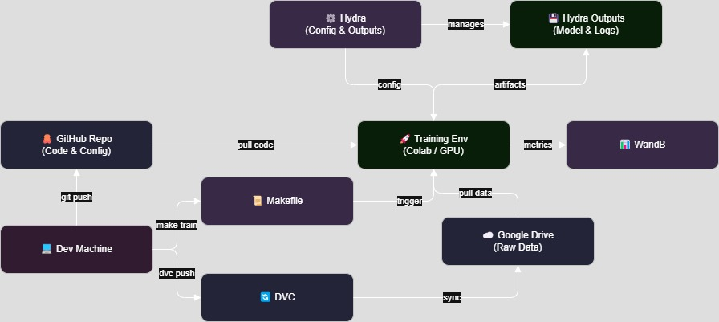

# Image Classification with Drift Detection

<a target="_blank" href="https://cookiecutter-data-science.drivendata.org/">
    
</a>

MLOps pipeline for image classification on Imagenette-160, featuring automated data drift detection and retraining.

## Project Organization

```
├── LICENSE            <- Open-source license if one is chosen
├── Makefile           <- Makefile with convenience commands like `make data` or `make train`
├── README.md          <- The top-level README for developers using this project.
├── data
│   ├── external       <- Data from third party sources.
│   ├── interim        <- Intermediate data that has been transformed.
│   ├── processed      <- The final, canonical data sets for modeling.
│   └── raw            <- The original, immutable data dump.
│
├── docs               <- A default mkdocs project; see www.mkdocs.org for details
│
├── models             <- Trained and serialized models, model predictions, or model summaries
│
├── notebooks          <- Jupyter notebooks. Naming convention is a number (for ordering),
│                         the creator's initials, and a short `-` delimited description, e.g.
│                         `1.0-jqp-initial-data-exploration`.
│
├── pyproject.toml     <- Project configuration file with package metadata for 
│                         drift_detector_pipeline and configuration for tools like black
│
├── references         <- Data dictionaries, manuals, and all other explanatory materials.
│
├── reports            <- Generated analysis as HTML, PDF, LaTeX, etc.
│   └── figures        <- Generated graphics and figures to be used in reporting
│
├── requirements.txt   <- The requirements file for reproducing the analysis environment, e.g.
│                         generated with `pip freeze > requirements.txt`
│
├── setup.cfg          <- Configuration file for flake8
│
└── drift_detector_pipeline   <- Source code for use in this project.
    │
    ├── __init__.py             <- Makes drift_detector_pipeline a Python module
    │
    ├── config.py               <- Store useful variables and configuration
    │
    ├── dataset.py              <- Scripts to download or generate data
    │
    ├── features.py             <- Code to create features for modeling
    │
    ├── modeling                
    │   ├── __init__.py 
    │   ├── predict.py          <- Code to run model inference with trained models          
    │   └── train.py            <- Code to train models
    │
    └── plots.py                <- Code to create visualizations
```

---

## 1. Team Information
-   **Team Name:** Team Zeal
-   **Team Members:**
    -   Montelongo, Esteban - EMONTEL1@depaul.edu
    -   Bandara, Sajith - SBANDARA@depaul.edu
    -   Sankar Chandrasekar, Arjun Kumar - ASANKARC@depaul.edu
-   **Course & Section:** SE 489: ML Engineering For Production (MLOps)

## 2. Project Overview
-   **Summary:** This project implements an end-to-end MLOps pipeline to train an image classification model (ResNet-18 using `timm`) on the Imagenette-160 dataset, monitor for data drift, and eventually automate retraining.
-   **Problem Statement:** Machine learning models deployed in production often suffer performance degradation over time due to changes in the underlying data distribution (data drift). This project aims to build a system that can automatically detect such drift in an image classification task and maintain model performance through automated retraining.
-   **Main Objectives (Phase 1 Focus):**
    1.  Establish a reproducible baseline training pipeline for ResNet-18 on clean Imagenette-160 data, achieving ≥85% validation accuracy. *(Achieved: 96.76%)*
    2.  Set up version control for data (DVC) and code (Git). *(Completed)*
    3.  Integrate configuration management (Hydra) and experiment tracking (WandB). *(Completed)*
    4.  Structure the codebase for future drift simulation and detection implementation. *(Completed)*
    5.  Implement basic unit tests for data handling. *(Completed)*

## 3. Project Architecture Diagram (Phase 1)

*(This diagram represents the components set up in Phase 1: Data acquisition/versioning with DVC/G-Drive, Code versioning with Git/GitHub, Training pipeline using PyTorch/timm, Configuration via Hydra, Experiment Tracking via WandB, Unit Testing via Pytest, and local execution via Make.)*

## 4. Phase Deliverables
-   [X] [PHASE1.md](./PHASE1.md): Project Design & Model Development *(Completed)*
-   [ ] PHASE2.md: Enhancing ML Operations *(Upcoming)*
-   [ ] PHASE3.md: Continuous ML & Deployment *(Upcoming)*

## 5. Setup Instructions

This section guides you through setting up the project environment for both local host development and Docker-based execution.

1.  **Clone Repository:**
    ```bash
    git clone https://github.com/estmon8u/team-zeal-project.git # Or use your SSH URL
    cd team-zeal-project
    ```

2.  **Prerequisites:**
    *   **Python:** Version 3.10 or higher (as defined in `pyproject.toml`).
    *   **Make:** GNU Make.
        *   Linux/macOS: Usually pre-installed or easily installable via package managers.
        *   Windows: Requires installation (e.g., via [Chocolatey `choco install make`](https://chocolatey.org/packages/make), [GnuWin32](http://gnuwin32.sourceforge.net/packages/make.htm), or using the Make within WSL or Git Bash).
    *   **Docker Desktop:** Required for building and running Docker containers. Download from the [official Docker website](https://www.docker.com/products/docker-desktop/). Ensure it's running.
    *   **DVC:** Installed as part of Python dependencies (see step 4).

3.  **Create & Activate Virtual Environment (Recommended for Host Development):**
    ```bash
    # Create (only once, using the project's configured Python interpreter)
    make create_environment # Uses PYTHON_INTERPRETER defined in Makefile

    # Activate (each time you work on the project locally)
    # Mac/Linux:
    source .venv/bin/activate
    # Windows Cmd:
    # .venv\Scripts\activate.bat
    # Windows PowerShell:
    # .\.venv\Scripts\Activate.ps1
    ```

4.  **Install Python Dependencies (for Host Development):**
    (Ensure your virtual environment is activated if you created one)
    ```bash
    make requirements
    ```

5.  **Set up Weights & Biases (WandB):**
    *   **Create Account:** If you don't have one, sign up at [wandb.ai](https://wandb.ai).
    *   **API Key for Local Development (Recommended):**
        1.  Log in to WandB and go to your Authorize page (wandb.ai/authorize) to get your API key.
        2.  Create a `.env` file in the project root (this file is in `.gitignore`):
            ```env
            # .env (Do NOT commit this file)
            WANDB_API_KEY="YOUR_ACTUAL_WANDB_API_KEY_HERE"
            ```
        3.  The `Makefile` will automatically pick up this key if the `.env` file exists when running Dockerized commands. For host execution, `wandb` will find it or prompt if not found.
    *   **Team Collaboration:** For team projects, ensure you are part of the correct WandB team/entity (specified in `conf/config.yaml` under `wandb.entity`).

6.  **Set up DVC Google Drive Authentication (Service Account - CRITICAL for Docker/CI):**

    This project uses DVC with Google Drive. For reliable, non-interactive authentication (especially within Docker and for CI/CD), a Google Cloud Service Account is used.

    *   **6.1. Create Google Cloud Service Account & Key:**
        1.  In the Google Cloud Platform (GCP) Console, navigate to "IAM & Admin" > "Service Accounts."
        2.  Create a new service account (e.g., `dvc-gdrive-access-YOUR_INITIALS`).
        3.  Download a JSON key for this service account.
    *   **6.2. Store the Service Account Key Securely:**
        1.  Create a directory named `.secrets` in the root of this project.
        2.  Rename the downloaded JSON key to `gdrive-dvc-service-account.json` and place it inside this `.secrets` directory. The full path should be: `YOUR_PROJECT_ROOT/.secrets/gdrive-dvc-service-account.json`.
        3.  **CRITICAL:** The `.secrets/` directory (and its contents) **MUST** be listed in your project's `.gitignore` file AND `.dockerignore` file to prevent the key from being committed to version control or included in Docker images. (Your current `.dockerignore` includes `.secrets/`).
    *   **6.3. Share DVC Google Drive Folder:**
        *   Go to the Google Drive folder used as your DVC remote (the ID is in `.dvc/config`, e.g., `gdrive://19qyjvhry7pP9AF4q03hbKl4M5EWhrtk2`).
        *   Share this folder with the **service account's email address** (e.g., `your-sa@your-project.iam.gserviceaccount.com`), granting it **"Editor"** permissions.
    *   **6.4. DVC Configuration (`.dvc/config.local`):**
        *   Ensure the file `.dvc/config.local` (which should be in `.dvc/.gitignore`) exists and contains the following to instruct DVC to use the service account (the path is a fallback, as the entrypoint script handles the primary logic via environment variables):
            ```ini
            # .dvc/config.local
            ['remote "gdrive"']
                gdrive_use_service_account = true
                # This path is a fallback/placeholder if GDRIVE_CREDENTIALS_DATA isn't set by the entrypoint.
                # The entrypoint script will prioritize GDRIVE_CREDENTIALS_DATA.
                gdrive_service_account_json_file_path = /tmp/dummy_gdrive_key.json
            ```
    *   **6.5. DVC Cache (Host Setup - Optional but Recommended for Performance):**
        *   The `Makefile` attempts to mount a host DVC cache directory into Docker containers to speed up DVC operations. By default, it expects this at `~/.cache/dvc` (Linux/macOS) or `%USERPROFILE%/.cache/dvc` (Windows).
        *   Run `make ensure_host_dvc_cache` once on your host to try and create this directory if it doesn't exist. DVC will also create it on its first use on the host.

## 6. Usage Instructions

All primary operations can be run via `make` commands from the project root directory.

### 6.1. Working Locally on Your Host Machine

(Ensure your virtual environment is activated: `source .venv/bin/activate` or Windows equivalent)

*   **Pull DVC Data:**
    *   Before first use, or to get updates if you are *not* using the Docker workflow for DVC operations, you need to authenticate DVC on your host to Google Drive. The recommended way for the host when using a service account is to set the `GDRIVE_CREDENTIALS_DATA` environment variable:
        ```bash
        # Linux/macOS (run in your shell before 'make dvc_pull')
        export GDRIVE_CREDENTIALS_DATA=$(cat .secrets/gdrive-dvc-service-account.json | tr -d '\n\r')

        # Windows (PowerShell, run in your shell before 'make dvc_pull')
        $env:GDRIVE_CREDENTIALS_DATA = Get-Content -Raw -Path ".\.secrets\gdrive-dvc-service-account.json"
        ```
    *   Then, pull the specific raw data target:
        ```bash
        make dvc_pull
        ```
*   **Process Data (Extract, etc.):**
    ```bash
    make process_data
    ```
*   **Train Model:**
    ```bash
    # Basic training run
    make train

    # Override Hydra configuration parameters
    make train HYDRA_ARGS="training.epochs=5 model.name=resnet34"
    ```
*   **Run Tests:**
    ```bash
    make test
    ```
*   **Lint & Format Code:**
    ```bash
    make lint   # Check formatting and style
    make format # Apply auto-formatting
    ```
*   **Clean Workspace:**
    ```bash
    make clean  # Removes __pycache__, .coverage, build artifacts, etc.
    ```

### 6.2. Working with Docker (Recommended for Reproducible Environments)

The Docker setup uses an entrypoint script (`docker-entrypoint.sh`) that automatically configures DVC authentication inside the container using the service account key.

*   **Build Docker Image:**
    (Only needed once, or after changes to `Dockerfile`, project dependencies, or source code `COPY`ed into the image)
    ```bash
    make docker_build
    # Or specify a tag: make docker_build IMAGE_TAG=custom-tag
    ```
*   **Run Interactive Shell in Docker:**
    (Useful for debugging or running ad-hoc commands inside the containerized environment)
    ```bash
    make docker_shell
    ```
    Inside the shell, you are at `/app`. You can run `make` targets like `make lint`, `make test`, or DVC commands.
*   **Pull DVC Data *Inside* Docker:**
    (This uses the service account key mounted into the container)
    ```bash
    make docker_dvc_pull
    ```
*   **Process Data *Inside* Docker:**
    (Assumes DVC data is pulled either on host and mounted, or via `make docker_dvc_pull`)
    ```bash
    # This will run 'make process_data' inside the container
    docker run -it --rm \
        $(DOCKER_VOLUMES) \
        $(GDRIVE_ENV_ARGS) \
        $(WANDB_ARGS) \
        $(USER_ARGS) \
        $(DOCKER_SHM_SIZE) \
        $(IMAGE_NAME):$(IMAGE_TAG) make process_data
    ```
*   **Train Model *Inside* Docker:**
    (This will run `make train` inside the container, which includes `make process_data` that in turn runs `make dvc_pull` inside the container)
    ```bash
    # Basic training run in Docker
    make docker_train

    # Override Hydra configuration
    make docker_train HYDRA_ARGS="training.epochs=5 data.dataloader_workers=2"
    ```
    *   **How DVC Authentication Works in Docker:**
        1.  The `Makefile` (when running `make docker_train`, etc.) mounts your local `.secrets/gdrive-dvc-service-account.json` to `/app/.secrets/gdrive-dvc-service-account.json` inside the container (read-only).
        2.  It also sets the `GDRIVE_KEY_FILE_PATH_IN_CONTAINER` environment variable to this path.
        3.  The `docker-entrypoint.sh` script reads the key from this path, validates it, and exports its content to the `GDRIVE_CREDENTIALS_DATA` environment variable.
        4.  DVC commands (like `dvc pull` run via `make dvc_pull` inside the container's `make process_data` step) automatically use this `GDRIVE_CREDENTIALS_DATA` for non-interactive authentication to Google Drive.
    *   **WandB in Docker:** If `WANDB_API_KEY` is set in your host environment (or `.env` file), it will be passed into the Docker container, allowing non-interactive WandB logging.
*   **Run Tests *Inside* Docker:**
    ```bash
    make docker_test
    ```

### 6.3. Understanding Key Makefile Variables for Docker

The `Makefile` uses several variables to configure Docker runs. You can often override these if needed (e.g., `make docker_train IMAGE_TAG=test ...`):

*   `IMAGE_NAME`: Name of the Docker image (default: `team-zeal-project`).
*   `IMAGE_TAG`: Tag for the Docker image (default: `1.0.0` - *update this in your Makefile as you version*).
*   `HOST_DVC_CACHE_DIR`: Path on your host machine for the shared DVC cache (default: `~/.cache/dvc` or `%USERPROFILE%/.cache/dvc`). Mounted into the container to speed up DVC operations.
*   `HOST_SERVICE_ACCOUNT_KEY_PATH`: Path on your host to the Google Drive DVC service account JSON key (default: `./.secrets/gdrive-dvc-service-account.json`).
*   `HYDRA_ARGS`: Pass arguments to Hydra when running training (e.g., `make docker_train HYDRA_ARGS="training.epochs=1"`).
*   `WANDB_API_KEY`: Set this in your host environment or `.env` file to enable WandB logging from Docker.

## 7. For CI/CD Pipelines (e.g., GitHub Actions, GitLab CI)

This setup is designed for CI/CD:

1.  **Build & Push Docker Image:** Your CI pipeline should build the Docker image (`make docker_build`) and push it to a container registry.
2.  **Run Jobs:** Subsequent CI jobs (e.g., for testing or training) will pull this image.
3.  **Secrets Management:**
    *   **DVC (Google Drive Service Account):**
        1.  Store the *content* of your `gdrive-dvc-service-account.json` file as a CI/CD secret (e.g., GitHub Secret named `GDRIVE_SA_KEY_JSON_CONTENT`).
        2.  In your CI pipeline script, when running the Docker container, pass this secret as the `GDRIVE_CREDENTIALS_DATA_CONTENT` environment variable:
            ```bash
            docker run --rm \
              -v "$(pwd):/app" \ # Mount current checkout for code, outputs
              -e GDRIVE_CREDENTIALS_DATA_CONTENT="${YOUR_CI_SECRET_HERE}" \
              # Potentially mount a CI-specific DVC cache volume
              # -v "/path/to/ci/dvc_cache:/root/.dvc/cache" \
              your-image-name:tag \
              make train # Or other targets
            ```
            The `docker-entrypoint.sh` script will detect `GDRIVE_CREDENTIALS_DATA_CONTENT` and configure DVC.
    *   **WandB API Key:**
        1.  Store your WandB API key as a CI/CD secret (e.g., `WANDB_API_KEY_SECRET`).
        2.  Pass it to `docker run`:
            ```bash
            docker run --rm \
              # ... other args ...
              -e WANDB_API_KEY="${WANDB_API_KEY_SECRET}" \
              your-image-name:tag \
              make train
            ```


## 7. Contribution Summary (Phase 1)
-   **Esteban Montelongo:** DVC setup & data versioning, `dataset.py` (extraction, transforms, dataloaders), initial documentation structure (`README.md`, `PHASE1.md`), architecture diagram, model DVC tracking, unit test implementation.
-   **Sajith Bandara:** Hydra integration (`conf/config.yaml`, `train.py` decorator/config usage), `train.py` core structure (model loading, optimizer, scheduler, loop), Makefile setup (`train`, `process_data` rules), model saving path correction.
-   **Arjun Kumar Sankar Chandrasekar:** WandB integration (`wandb.init`, `wandb.log`), dependency management (`pyproject.toml`, `requirements.txt`), `ruff` configuration and code formatting, testing infrastructure setup and test contributions.


## 8. References & Key Tools Used
-   **Dataset:** [Imagenette-160 (v2)](https://github.com/fastai/imagenette)
-   **ML Framework:** [PyTorch](https://pytorch.org/)
-   **Model Zoo:** [timm (PyTorch Image Models)](https://github.com/huggingface/pytorch-image-models)
-   **Data Versioning:** [DVC (Data Version Control)](https://dvc.org/) + Google Drive
-   **Configuration Management:** [Hydra](https://hydra.cc/)
-   **Experiment Tracking:** [Weights & Biases (WandB)](https://wandb.ai/)
-   **Code Quality:** [Ruff](https://github.com/astral-sh/ruff) (Linting & Formatting), [Pytest](https://pytest.org/) (Testing)
-   **Version Control:** [Git](https://git-scm.com/) & [GitHub](https://github.com/)
-   **Build/Task Runner:** [GNU Make](https://www.gnu.org/software/make/)
-   **Python Environment:** `venv` + `pip`
-   **Project Template:** [Cookiecutter Data Science](https://cookiecutter-data-science.drivendata.org/)