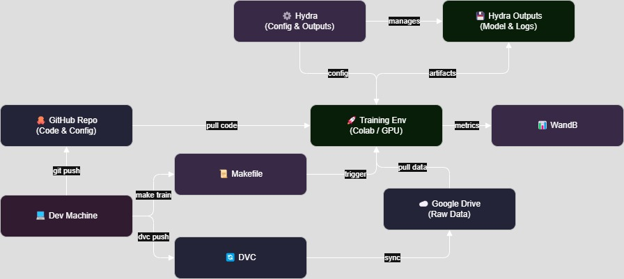

# Image Classification with Drift Detection

<a target="_blank" href="https://cookiecutter-data-science.drivendata.org/">
    
</a>

MLOps pipeline for image classification on Imagenette-160, featuring automated data drift detection and retraining.

## Project Organization

```
├── LICENSE            <- Open-source license if one is chosen
├── Makefile           <- Makefile with convenience commands like `make data` or `make train`
├── README.md          <- The top-level README for developers using this project.
├── data
│   ├── external       <- Data from third party sources.
│   ├── interim        <- Intermediate data that has been transformed.
│   ├── processed      <- The final, canonical data sets for modeling.
│   └── raw            <- The original, immutable data dump.
│
├── docs               <- A default mkdocs project; see www.mkdocs.org for details
│
├── models             <- Trained and serialized models, model predictions, or model summaries
│
├── notebooks          <- Jupyter notebooks. Naming convention is a number (for ordering),
│                         the creator's initials, and a short `-` delimited description, e.g.
│                         `1.0-jqp-initial-data-exploration`.
│
├── pyproject.toml     <- Project configuration file with package metadata for 
│                         drift_detector_pipeline and configuration for tools like black
│
├── references         <- Data dictionaries, manuals, and all other explanatory materials.
│
├── reports            <- Generated analysis as HTML, PDF, LaTeX, etc.
│   └── figures        <- Generated graphics and figures to be used in reporting
│
├── requirements.txt   <- The requirements file for reproducing the analysis environment, e.g.
│                         generated with `pip freeze > requirements.txt`
│
├── setup.cfg          <- Configuration file for flake8
│
└── drift_detector_pipeline   <- Source code for use in this project.
    │
    ├── __init__.py             <- Makes drift_detector_pipeline a Python module
    │
    ├── config.py               <- Store useful variables and configuration
    │
    ├── dataset.py              <- Scripts to download or generate data
    │
    ├── features.py             <- Code to create features for modeling
    │
    ├── modeling                
    │   ├── __init__.py 
    │   ├── predict.py          <- Code to run model inference with trained models          
    │   └── train.py            <- Code to train models
    │
    └── plots.py                <- Code to create visualizations
```

---

## 1. Team Information
-   **Team Name:** Team Zeal
-   **Team Members:**
    -   Montelongo, Esteban - EMONTEL1@depaul.edu
    -   Bandara, Sajith - SBANDARA@depaul.edu
    -   Sankar Chandrasekar, Arjun Kumar - ASANKARC@depaul.edu
-   **Course & Section:** SE 489: ML Engineering For Production (MLOps)

## 2. Project Overview
-   **Summary:** This project implements an end-to-end MLOps pipeline to train an image classification model (ResNet-18 using `timm`) on the Imagenette-160 dataset, monitor for data drift, and eventually automate retraining.
-   **Problem Statement:** Machine learning models deployed in production often suffer performance degradation over time due to changes in the underlying data distribution (data drift). This project aims to build a system that can automatically detect such drift in an image classification task and maintain model performance through automated retraining.
-   **Main Objectives (Phase 1 Focus):**
    1.  Establish a reproducible baseline training pipeline for ResNet-18 on clean Imagenette-160 data, achieving ≥85% validation accuracy. *(Achieved: 96.76%)*
    2.  Set up version control for data (DVC) and code (Git). *(Completed)*
    3.  Integrate configuration management (Hydra) and experiment tracking (WandB). *(Completed)*
    4.  Structure the codebase for future drift simulation and detection implementation. *(Completed)*
    5.  Implement basic unit tests for data handling. *(Completed)*

## 3. Project Architecture Diagram (Phase 1)

*(This diagram represents the components set up in Phase 1: Data acquisition/versioning with DVC/G-Drive, Code versioning with Git/GitHub, Training pipeline using PyTorch/timm, Configuration via Hydra, Experiment Tracking via WandB, Unit Testing via Pytest, and local execution via Make.)*

## 4. Phase Deliverables
-   [X] [PHASE1.md](./PHASE1.md): Project Design & Model Development *(Completed)*
-   [X] PHASE2.md: Enhancing ML Operations *(Completed)*
-   [ ] PHASE3.md: Continuous ML & Deployment *(Upcoming)*

### Phase 2: Enhancing ML Operations - Key Features

This phase focused on operational robustness, reproducibility, and monitoring. Key enhancements include:

*   **Containerization:** Setup for building and running the project in a Docker container. ([See Docker Containerization](#docker-containerization))
*   **Debugging Practices:** Guidance on debugging techniques and tools. ([See Monitoring & Debugging](#monitoring--debugging))
*   **Profiling & Optimization:** Tools and methods for profiling training scripts. ([See Profiling & Optimization](#profiling--optimization))
*   **Advanced Experiment Tracking:** Leveraging Weights & Biases for detailed experiment analysis. ([See Visualizing and Comparing Runs with Weights & Biases](#visualizing-and-comparing-runs-with-weights--biases))
*   **Application Logging:** Understanding and using the application's logging system. ([See Application and Experiment Logging](#application-and-experiment-logging))
*   **Flexible Configuration:** Detailed explanation on using Hydra for managing and overriding experiment configurations. ([See Overriding Config (Example) under Usage Instructions](#6-usage-instructions) for details on command-line overrides.)
*   **Updated Documentation:** All new tools and processes are documented within this README.

## 5. Setup Instructions

1.  **Clone Repository:**
    ```bash
    git clone https://github.com/estmon8u/team-zeal-project.git # Or use SSH URL
    cd team-zeal-project
    ```
2.  **Create & Activate Virtual Environment:**
    ```bash
    # Create (only once)
    python -m venv .venv
    # Activate (each time you work on the project)
    # Mac/Linux:
    source .venv/bin/activate
    # Windows Cmd:
    # .venv\Scripts\activate.bat
    # Windows PowerShell:
    # .venv\Scripts\Activate.ps1
    ```
3.  **Install Dependencies:**
    ```bash
    # Ensure pip is up-to-date
    python -m pip install --upgrade pip
    
    # Install project dependencies (includes DVC, PyTorch, etc.)
    pip install -e . 
    ```
4.  **Accept WandB Team Invitation & Login (First Time Only - For Original Team):**
    *   If you are part of the original project team and want to log to the shared WandB space: Ensure you have accepted the invitation to join the **`emontel1-depaul-university`** team/entity on WandB.
    *   Run `wandb login` in your terminal and follow the prompts to authenticate.
    *   *For general users setting up their own instance, you will configure your own WandB project/entity later if desired (see `conf/config.yaml`).*

5.  **Setting Up DVC (Data Version Control) with Your Own Remote Storage:**

    This project uses DVC to manage large data files and models. The Git repository contains `.dvc` metafiles that point to the actual data. If you want to replicate the project with your own data storage, follow these steps (using Google Drive as an example):

*   **5.1. Initialize DVC (if starting a project from absolute scratch):**
    Your cloned repository should already have a `.dvc` directory and configuration. If it didn't (e.g., you were starting a new project based on this one), you would run:
    ```bash
    dvc init
    ```
    This creates the `.dvc` directory and a basic configuration.

*   **5.2. Configure Your DVC Remote (Example: Google Drive):**
    1.  **Create a folder in your Google Drive** where you want to store the DVC-tracked files.
    2.  **Get the Folder ID:** Open the folder in Google Drive. The ID is the last part of the URL (e.g., if the URL is `https://drive.google.com/drive/folders/ABCDEFG12345`, the ID is `ABCDEFG12345`).
    3.  **Modify or Add DVC Remote Configuration:**
        The existing `.dvc/config` file in this repository points to the original authors' Google Drive. You'll need to update it to point to *your* Google Drive folder, or add a new remote.

        **Option A: Modify the existing 'gdrive' remote (Recommended for simplicity if you're the primary user of your fork):**
        ```bash
        dvc remote modify gdrive url gdrive://YOUR_GOOGLE_DRIVE_FOLDER_ID
        ```
        Replace `YOUR_GOOGLE_DRIVE_FOLDER_ID` with the ID you obtained.

        **Option B: Add a new remote (if you want to keep the original remote config for reference):**
        ```bash
        dvc remote add mygdrive gdrive://YOUR_GOOGLE_DRIVE_FOLDER_ID
        dvc remote default mygdrive # Set your new remote as the default
        ```

    4.  **Set DVC Google Drive Credentials (Optional but Recommended for Automation/CI):**
        By default, DVC will use `gdrive_use_default_credential true` which prompts for browser authentication. For more control or non-interactive environments, you might configure specific OAuth credentials.
        ```bash
        # Example: Use default browser authentication (usually sufficient for personal use)
        dvc remote modify gdrive gdrive_use_default_credential true 
        # If you added 'mygdrive', use:
        # dvc remote modify mygdrive gdrive_use_default_credential true
        ```
        For advanced credential setup (e.g., service accounts or your own client ID/secret), refer to the [official DVC Google Drive documentation](https://dvc.org/doc/user-guide/data-management/remote-storage/google-drive).
        *Security Note: Be careful with client secrets. Do not commit them directly to Git. Use `.dvc/config.local` (which is in `.dvc/.gitignore`) for sensitive remote configurations if needed.*

    5.  **Authenticate DVC with Google Drive:**
        The first time you run a DVC command that interacts with the remote (like `dvc push` or `dvc pull` in the next steps), you will likely be prompted to authenticate via your browser. Follow the instructions, making sure to log in with your Google account that has access to the folder you created.

*   **5.3. Download and Version the Raw Dataset:**
    1.  **Download the Dataset:** The Imagenette-160 (v2 split) dataset can be downloaded from the [FastAI GitHub repository](https://github.com/fastai/imagenette).
        Direct link to `imagenette2-160.tgz`: [https://s3.amazonaws.com/fast-ai-imageclas/imagenette2-160.tgz](https://s3.amazonaws.com/fast-ai-imageclas/imagenette2-160.tgz)
    2.  **Place the Dataset:** Create the directory `data/raw/` if it doesn't exist, and place the downloaded `imagenette2-160.tgz` file into it.
        The path should be: `data/raw/imagenette2-160.tgz`
    3.  **Track with DVC:** Tell DVC to track this file. This will create/overwrite `data/raw/imagenette2-160.tgz.dvc`.
        ```bash
        dvc add data/raw/imagenette2-160.tgz
        ```
    4.  **Commit the Metafile to Git:**
        ```bash
        git add data/raw/imagenette2-160.tgz.dvc .dvc/config 
        git commit -m "feat: Track raw Imagenette dataset with DVC and update remote config"
        ```
    5.  **Push to Your DVC Remote:**
        ```bash
        dvc push
        ```
        This uploads the `imagenette2-160.tgz` (as managed by DVC) to your configured Google Drive folder.

*   **5.4. Baseline Model (You will train your own):**
    The `.dvc` file for the baseline model (`models/resnet18_baseline_v1.pth.dvc`) in this repository points to the original authors' DVC storage.
    **You will train your own baseline model in the "Usage Instructions" (Step 3: Run Baseline Model Training).**
    After training, your best model will be saved (e.g., in `outputs/YYYY-MM-DD/HH-MM-SS/best_model.pth`). You can then optionally track this model with DVC:
    ```bash
    # Example after training:
    # dvc add outputs/YYYY-MM-DD/HH-MM-SS/best_model.pth -o models/my_resnet18_baseline_v1.pth
    # git add models/my_resnet18_baseline_v1.pth.dvc
    # git commit -m "model: Add my trained baseline model to DVC"
    # dvc push
    ```
    For now, you don't need to pull any pre-existing DVC-tracked model. If you see a DVC file for a model, you can generally ignore it until you've trained your own.


## 6. Usage Instructions

1.  **Activate Environment:**
    ```bash
    source .venv/bin/activate # Or Windows equivalent
    ```
2.  **Process Raw Data (Download via DVC & Extract Archive):**
    -   Ensure you have completed **Section 5: Setting Up DVC** if this is your first time or if you are setting up your own DVC remote. This includes configuring your remote and, if you are the first to set up this dataset on your remote, pushing the raw data to it (as per Step 5.3).
    -   To download the DVC-tracked raw data (e.g., `imagenette2-160.tgz`) and then extract it, run:
        ```bash
        make process_data
        ```
    -   This command will first attempt to run `make dvc_pull` (which executes `dvc pull` to download all DVC-tracked files from your configured remote, including `data/raw/imagenette2-160.tgz`).
    -   Then, it will extract `data/raw/imagenette2-160.tgz` into `data/processed/imagenette2-160/`.

3.  **Run Baseline Model Training:**
    *(Ensure WandB is set up if you want to log to your own WandB account - see `conf/config.yaml` to set your project/entity, and run `wandb login` once if needed).*
    -   Execute the training using the Makefile (uses `conf/config.yaml` by default):
        ```bash
        make train
        ```
    -   Monitor progress in the terminal and on your WandB project dashboard (if configured).
    -   Hydra will create an output directory (e.g., `outputs/YYYY-MM-DD/HH-MM-SS/`) containing logs, Hydra configs, and the saved `best_model.pth`.

    *   **Override Config (Example):**
        ```bash
        python -m drift_detector_pipeline.modeling.train training.epochs=5 training.learning_rate=0.0005
        ```

    This project uses [Hydra](https://hydra.cc/) for configuration management, allowing for flexible and powerful control over experiment parameters directly from the command line. The base configuration is defined in `conf/config.yaml`.

    *   **Reiterating the Basic Override Syntax:**
        You can override any parameter from `conf/config.yaml` without editing the file directly using the syntax:
        ```bash
        python -m drift_detector_pipeline.modeling.train <param_group>.<param_name>=<value>
        ```
        Multiple parameters can be overridden by listing them one after another.

    *   **More Diverse Examples:**
        *   **Changing Model:** To train a different model architecture (e.g., Vision Transformer instead of the default ResNet), assuming your `conf/model` config group supports it:
            ```bash
            # Example: Train a ViT model (if defined in conf/model/vit_tiny_patch16_224.yaml)
            python -m drift_detector_pipeline.modeling.train model=vit_tiny_patch16_224 
            # Or if model.name is a direct parameter:
            # python -m drift_detector_pipeline.modeling.train model.name=vit_tiny_patch16_224
            ```
        *   **Adjusting Training Parameters:** Change learning rate, number of epochs, optimizer settings, etc.
            ```bash
            # Change learning rate and number of epochs
            python -m drift_detector_pipeline.modeling.train training.learning_rate=0.0001 training.epochs=15
            # Change optimizer (if you have different optimizer configs like conf/optimizer/adamw.yaml)
            # python -m drift_detector_pipeline.modeling.train optimizer=adamw training.learning_rate=0.0002
            ```
        *   **Modifying Data Parameters:** Adjust batch size, number of dataloader workers, or other data-related settings.
            ```bash
            # Use a different batch size and number of dataloader workers
            # Note: Parameter names like 'training.batch_size' or 'data.batch_size' depend on your config.yaml structure.
            # Assuming 'data.batch_size' and 'data.num_workers' from conf/data/default.yaml
            python -m drift_detector_pipeline.modeling.train data.batch_size=32 data.num_workers=4
            ```
        *   **Running on CPU:** If you need to force the training to run on the CPU, even if a GPU is available:
            ```bash
            # Assuming 'run.device' is the parameter in your config.yaml
            python -m drift_detector_pipeline.modeling.train run.device=cpu
            ```
        *   **Changing Weights & Biases Project (for personal runs):** Log experiments to a different WandB project or entity for personal tracking or testing.
            ```bash
            # Log to a different WandB project and entity
            python -m drift_detector_pipeline.modeling.train wandb.project=my-personal-project wandb.entity=my-username wandb.log_model=false
            ```

    *   **Hydra's Output Directories:**
        Each time you run a script using Hydra (like `train.py`), it creates a unique output directory.
        *   For single runs, this directory is typically `outputs/YYYY-MM-DD/HH-MM-SS/`.
        *   If you were to use Hydra's multi-run capabilities (e.g., `python -m drift_detector_pipeline.modeling.train --multirun training.epochs=5,10,15`), outputs would be under `multirun/YYYY-MM-DD/HH-MM-SS-<JOB_NUMBER>/`.
        These directories contain:
            *   A snapshot of the full configuration used for that run (including your overrides) in `.hydra/config.yaml`.
            *   The log file for the run (e.g., `train.log`).
            *   Any other files saved by your script, such as model checkpoints (e.g., in a `checkpoints/` subdirectory).
        This organized output structure is crucial for experiment tracking and reproducibility.

    *   **`conf/config.yaml` as the Base:**
        Remember that `conf/config.yaml` (and other YAML files it might reference within the `conf/` directory, like `conf/model/default.yaml`) serves as the comprehensive base configuration. Command-line arguments provide temporary overrides for specific runs, allowing you to experiment without constantly modifying your main configuration files.

4.  **Run Linting/Formatting:**
    ```bash
    make lint  # Check formatting and linting using Ruff
    make format # Apply formatting and fix linting issues using Ruff
    ```
5.  **Run Tests:**
    ```bash
    make test # Executes unit tests defined in the tests/ directory using pytest
    ```

## Experiment Tracking with Weights & Biases

This project uses Weights & Biases (WandB) to log and visualize experiment results, track model performance, and manage artifacts. This is crucial for MLOps, enabling reproducibility, comparison of different model versions, and collaborative model development.

### Accessing WandB

*   When you run the training script (e.g., `make train` or `python -m drift_detector_pipeline.modeling.train`), experiment metrics, hyperparameters, and console logs are automatically sent to Weights & Biases.
*   **Finding Your Project URL:**
    *   The direct URL to your WandB project and specific run is usually printed in the console output when `train.py` starts. Look for lines similar to:
        ```
        wandb: Tracking run with wandb version ...
        wandb: Run data is saved locally in wandb/run-YYYYMMDD_HHMMSS-xxxxxxxx
        wandb: Syncing run cool-experiment-name to Weights & Biases (docs https://wandb.me/wandb-sync)
        wandb: View project at https://wandb.ai/<YOUR_ENTITY>/<YOUR_PROJECT>
        wandb: View run at https://wandb.ai/<YOUR_ENTITY>/<YOUR_PROJECT>/runs/<RUN_ID>
        ```
    *   Alternatively, you can navigate to your WandB account at [https://wandb.ai](https://wandb.ai) and find your project.
*   **Entity and Project Name:**
    *   Your WandB **entity** (usually your username or organization name) and **project name** are defined in the Hydra configuration file `conf/config.yaml` under the `wandb` key (e.g., `wandb.entity`, `wandb.project`). You'll need these to form the URL: `https://wandb.ai/<YOUR_ENTITY>/<YOUR_PROJECT>`.
    *   Ensure you have logged into WandB using `wandb login` in your terminal if it's your first time or if you are working in a new environment.

### Visualizing and Comparing Runs with Weights & Biases

The WandB dashboard offers powerful tools to analyze and compare your experiments.

*   **Overview/Workspace:**
    *   The main project page (Workspace) provides a dashboard with an overview of all runs. You can customize this workspace by adding, removing, or rearranging panels (charts, tables, etc.).

*   **Run Table:**
    *   The "Runs" tab displays a table listing all individual experiments.
    *   **Sorting:** Click on column headers to sort runs by metrics (e.g., `val/accuracy` to find the best performing run) or by configuration parameters.
    *   **Filtering:** Use the filter icon or search bar to narrow down runs based on specific criteria (e.g., `model.name is resnet18`, `training.learning_rate < 0.001`).
    *   **Grouping:** Group runs by configuration parameters (e.g., `model.name`, `training.optimizer.name`) to compare performance across different settings. This is very useful for seeing which set of hyperparameters performed best.
    *   **Columns:** Customize the visible columns to show specific hyperparameters or metrics relevant to your analysis.

*   **Charting:**
    *   WandB automatically logs metrics like `train/loss`, `val/loss`, `train/accuracy`, `val/accuracy` for each epoch.
    *   **Creating Custom Charts:**
        1.  On the project workspace or by selecting specific runs, click "Add panel" or look for visualization options (WandB UI may vary slightly).
        2.  Choose a chart type (e.g., Line Plot, Scatter Plot, Bar Chart).
        3.  For a line plot, you might set the X-axis to `Step` (or `epoch` if logged as such) and the Y-axis to a metric like `val/accuracy`.
    *   **Comparing Multiple Runs:**
        *   Select multiple runs from the run table. The charts will automatically update to show data from all selected runs, often color-coding them by run name or a chosen hyperparameter.
        *   You can group charts by parameters. For example, plot `val/accuracy` vs. `epoch` for different learning rates by selecting runs with varying `training.learning_rate`.
    *   **Advanced Plots:** Explore features like "Parallel Coordinates" to visualize relationships across many hyperparameters and metrics, or "Parameter Importance" to see which hyperparameters most affect your target metric.

*   **Artifacts (Model Tracking):**
    *   This project is configured to save trained models as WandB Artifacts (if `wandb.log_model` is true in `conf/config.yaml`).
    *   **Viewing Artifacts:** Navigate to the "Artifacts" tab in your project. You'll see different versions of your models, often tagged with run IDs or version numbers.
    *   **Model Lineage:** Click on an artifact to see its lineage – which run created it, what data it was trained on (if data is also an artifact), and its specific configuration. This is crucial for reproducibility.
    *   **Downloading Models:** You can download model files directly from the WandB UI by navigating to the specific artifact version and looking for download options.

*   **Hyperparameter Sweeps (Brief Mention):**
    *   WandB also supports "Sweeps," a powerful feature for automating hyperparameter optimization. You can define a search space for your hyperparameters (e.g., ranges for learning rate, choices for optimizer) and a search strategy (e.g., Bayesian, random). WandB agents then run multiple experiments to find optimal configurations.
    *   Setting up sweeps involves a separate YAML configuration and is beyond the scope of basic run visualization but is a valuable next step for advanced MLOps.

### Example Workflow: Comparing Validation Accuracy

Let's say you've run experiments with two different model architectures, e.g., `resnet18` and `vit_tiny_patch16_224` (assuming `model.name` is logged as a hyperparameter).

1.  **Navigate to your WandB project page.**
2.  Go to the **Runs table**.
3.  **Filter or Select Runs:**
    *   You can filter runs by `model.name` to show only those with `resnet18` or `vit_tiny_patch16_224`.
    *   Alternatively, manually select the specific runs you want to compare from the table.
4.  **Visualize:**
    *   With the desired runs selected/filtered, you might already see relevant charts on your workspace, or you can add a new panel.
    *   Click "Add panel" (or a similar button like "Visualize" or "Create new chart").
    *   Choose a **Line Plot**.
    *   Set the **X-axis** to `epoch` (or `Step` if `epoch` isn't explicitly logged as the x-axis for metrics).
    *   Set the **Y-axis** to `val/accuracy` (or your primary validation metric).
    *   Ensure the plot is **grouped by** `run name` or a relevant config like `model.name` to see distinct lines for each model/run.
5.  **Analyze:** Observe the plot to see which model achieved better validation accuracy over epochs, how quickly they converged, and if there were any signs of overfitting. You can also add plots for `val/loss` or other metrics for a more comprehensive comparison.

By leveraging these WandB features, you can gain deeper insights into your model's performance, effectively compare different experiments, and maintain a well-organized and reproducible machine learning workflow.

## 7. Contribution Summary (Phase 1)
-   **Esteban Montelongo:** DVC setup & data versioning, `dataset.py` (extraction, transforms, dataloaders), initial documentation structure (`README.md`, `PHASE1.md`), architecture diagram, model DVC tracking, unit test implementation.
-   **Sajith Bandara:** Hydra integration (`conf/config.yaml`, `train.py` decorator/config usage), `train.py` core structure (model loading, optimizer, scheduler, loop), Makefile setup (`train`, `process_data` rules), model saving path correction.
-   **Arjun Kumar Sankar Chandrasekar:** WandB integration (`wandb.init`, `wandb.log`), dependency management (`pyproject.toml`, `requirements.txt`), `ruff` configuration and code formatting, testing infrastructure setup and test contributions.


## 8. References & Key Tools Used
-   **Dataset:** [Imagenette-160 (v2)](https://github.com/fastai/imagenette)
-   **ML Framework:** [PyTorch](https://pytorch.org/)
-   **Model Zoo:** [timm (PyTorch Image Models)](https://github.com/huggingface/pytorch-image-models)
-   **Data Versioning:** [DVC (Data Version Control)](https://dvc.org/) + Google Drive
-   **Configuration Management:** [Hydra](https://hydra.cc/)
-   **Experiment Tracking:** [Weights & Biases (WandB)](https://wandb.ai/)
-   **Code Quality:** [Ruff](https://github.com/astral-sh/ruff) (Linting & Formatting), [Pytest](https://pytest.org/) (Testing)
-   **Version Control:** [Git](https://git-scm.com/) & [GitHub](https://github.com/)
-   **Build/Task Runner:** [GNU Make](https://www.gnu.org/software/make/)
-   **Python Environment:** `venv` + `pip`
-   **Project Template:** [Cookiecutter Data Science](https://cookiecutter-data-science.drivendata.org/)

## Docker Containerization
This section provides instructions for building and running the project within a Docker container. This ensures a consistent environment for development and deployment.

### Building the Docker Image
To build the Docker image, navigate to the root directory of the project (where the `Dockerfile` is located) and run the following command:
```bash
docker build -t team-zeal-project .
```
This command tells Docker to:
- `build`: Create an image.
- `-t team-zeal-project`: Tag the image with the name `team-zeal-project` (you can choose a different tag).
- `.`: Use the current directory as the build context (where Docker looks for the `Dockerfile` and project files).

### Running the Docker Container
Once the image is built, you can run a container from it:
```bash
docker run -it --rm team-zeal-project
```
This command tells Docker to:
- `run`: Create and start a new container from an image.
- `-it`: Run the container in interactive mode (`-i`) and allocate a pseudo-TTY (`-t`). This allows you to interact with the container's shell (which is `bash` as defined in the `Dockerfile`).
- `--rm`: Automatically remove the container when it exits. This is useful for keeping your system clean.
- `team-zeal-project`: The name of the image to run.

You will be dropped into a `bash` shell inside the container, in the `/app` working directory. From here, you can:
- Run Makefile commands (e.g., `make process_data`, `make train`).
- Execute Python scripts.
- Explore the project files.

### Important Considerations:

*   **Data Persistence and DVC:**
    *   The provided `Dockerfile` copies the project state at the time of building the image. This includes any DVC metafiles (`.dvc` files).
    *   **Raw data tracked by DVC is NOT included in the Docker image by default to keep the image size small.**
    *   To use DVC inside the container to pull data or models, you will need to:
        1.  **Configure DVC Remotes:** If your DVC remote requires authentication (like Google Drive), you'll need to authenticate from within the container the first time you run `dvc pull`. This might involve `dvc remote modify <your-remote> gdrive_use_default_credential true` and then following browser authentication steps on your host machine.
        2.  **Mount Local DVC Cache (Optional but Recommended):** To avoid re-downloading data every time you run a new container, you can mount your local DVC cache directory into the container.
            ```bash
            docker run -it --rm \
              -v ~/.cache/dvc:/root/.cache/dvc \
              team-zeal-project
            ```
            *(Adjust `~/.cache/dvc` if your DVC cache is in a different location. Inside the container, DVC's cache is typically at `/root/.cache/dvc` if running as root).*
        3.  **Mount Data Directories:** For large datasets or if you want changes to data to persist outside the container, mount the `data` directory:
            ```bash
            docker run -it --rm \
              -v $(pwd)/data:/app/data \
              -v ~/.cache/dvc:/root/.cache/dvc \
              team-zeal-project
            ```
            Now, if you run `make process_data` (which includes `dvc pull`) inside the container, the data will be downloaded to the mounted `data` directory on your host machine.

*   **Outputs and Models:**
    *   By default, any files generated inside the container (like trained models in `outputs/` or reports) will be lost when the container exits (due to `--rm`).
    *   To persist these outputs, mount the relevant directories:
        ```bash
        docker run -it --rm \
          -v $(pwd)/data:/app/data \
          -v $(pwd)/outputs:/app/outputs \
          -v ~/.cache/dvc:/root/.cache/dvc \
          team-zeal-project
        ```
        This way, when you run `make train` inside the container, the resulting models and logs in `outputs/` will be saved to your host machine's `outputs/` directory.

*   **WandB Login:**
    *   If you plan to use Weights & Biases for experiment tracking from within the container, you'll need to log in. Run `wandb login` inside the container and follow the prompts. Your WandB credentials will be saved within the container's filesystem (or in a mounted volume if you configure WandB to use one).

*   **Makefile Commands:**
    *   The Makefile commands like `make process_data`, `make train`, `make test` should work as expected within the container's environment, provided the necessary data is available (e.g., via DVC pull or volume mounting).
    *   Ensure that any paths in your `Makefile` or scripts are relative to the project root (`/app` in the container) or are handled appropriately.

## Monitoring & Debugging

Effective monitoring and debugging are crucial for maintaining and troubleshooting any MLOps pipeline. This section provides guidance on debugging Python code within this project and specific scenarios you might encounter.

### 1. Debugging Practices

A debugger allows you to pause your program's execution at a specific point, inspect the state of variables, and step through the code line by line.

*   **Common Python Debuggers:**
    *   **`pdb` (Python Debugger):** A built-in, command-line debugger for Python. It's lightweight and available wherever Python is.
    *   **IDE Debuggers:** Most Integrated Development Environments (IDEs) like VSCode, PyCharm, etc., come with powerful graphical debuggers that offer a more visual experience with features like watch lists, call stack navigation, and conditional breakpoints.

*   **Setting Breakpoints with `pdb`:**
    To set a breakpoint in your Python code using `pdb`, add these two lines where you want execution to pause:
    ```python
    import pdb; pdb.set_trace()
    ```
    When your script hits this line, it will stop, and you'll be dropped into the `pdb` interactive shell in your terminal.

*   **Basic `pdb` Commands:**
    Once in the `pdb` shell, you can use various commands to interact with your code:
    *   `n` (next): Execute the current line and move to the next line in the current function.
    *   `s` (step): Step into a function call.
    *   `c` (continue): Continue execution until the next breakpoint or the end of the program.
    *   `p <variable>` (print): Print the value of `<variable>`. For example, `p my_variable`.
    *   `pp <variable>` (pretty-print): Pretty-print the value of `<variable>`. Useful for complex objects.
    *   `l` (list): List source code around the current line.
    *   `bt` (backtrace): Show the current call stack.
    *   `q` (quit): Quit the debugger and exit the program.
    *   `h` (help): Show a list of available commands. `h <command>` for help on a specific command.

### 2. Example Debugging Scenarios

Here are some scenarios tailored to this project:

*   **Scenario 1: Investigating a DataLoader Issue**
    *   **Problem:** The DataLoader in `drift_detector_pipeline/dataset.py` is raising an unexpected error during training, or you suspect the data batches are not shaped correctly.
    *   **Solution:**
        1.  Open `drift_detector_pipeline/dataset.py`.
        2.  Locate the `__getitem__` method of your `CustomDataset` (or equivalent) or the collate function if you are using one for custom batching logic.
        3.  Insert the breakpoint:
            ```python
            # Inside __getitem__(self, idx) before returning the sample
            # import pdb; pdb.set_trace() 
            # Or inside your collate_fn(batch)
            # import pdb; pdb.set_trace()
            ```
        4.  Run your training script (e.g., `make train` or `python -m drift_detector_pipeline.modeling.train`).
        5.  When `pdb` activates, you can inspect variables:
            *   `p image.shape` or `p label` (if `image` and `label` are variables in `__getitem__`).
            *   `p image.dtype` to check data types.
            *   If in a collate function, `p len(batch)` to see the number of items, or `p batch[0][0].shape` to inspect the shape of the first image in the first sample of the batch.
            *   Step through the transform pipeline if you suspect an augmentation is causing issues.

*   **Scenario 2: Debugging Model Training NaN Loss**
    *   **Problem:** During model training (`drift_detector_pipeline/modeling/train.py`), the calculated loss suddenly becomes `NaN` (Not a Number), halting effective training.
    *   **Solution:**
        1.  Open `drift_detector_pipeline/modeling/train.py`.
        2.  Find the training loop, specifically the line *after* `loss = criterion(outputs, labels)` (or equivalent).
        3.  Insert the breakpoint:
            ```python
            # Example: Inside the training loop
            # loss = criterion(outputs, targets)
            # if torch.isnan(loss): # Optional: break only if loss is NaN
            #    import pdb; pdb.set_trace()
            ```
        4.  Run training. When `pdb` activates (especially if you used the conditional breakpoint):
            *   `p loss.item()`: Check the loss value.
            *   `p outputs`: Inspect the model's raw outputs. Look for extreme values.
            *   `p targets`: Check the ground truth labels.
            *   `p inputs.min()`, `p inputs.max()`: Examine the input batch for very large or small values if they are not normalized correctly.
            *   If you suspect vanishing/exploding gradients:
                *   You might need to move the breakpoint to *before* `optimizer.step()` but *after* `loss.backward()`.
                *   Then inspect gradients: `p model.conv1.weight.grad` (or any other layer's parameters with `requires_grad=True`). Look for `None`, zeros, or extremely large gradient values.

*   **Scenario 3: Configuration Problems with Hydra**
    *   **Problem:** The Hydra configuration (`conf/config.yaml`) isn't loading as expected, paths are incorrect, or there's an OmegaConf interpolation error when the script starts.
    *   **Solution:**
        1.  Open `drift_detector_pipeline/modeling/train.py` (or any script that uses `@hydra.main()`).
        2.  At the very beginning of your `train` function (or the function decorated by `@hydra.main()`), add:
            ```python
            from omegaconf import OmegaConf
            print("--- Resolved Hydra Configuration ---")
            print(OmegaConf.to_yaml(cfg))
            print("------------------------------------")
            # Optional: If you suspect an issue during OmegaConf's processing itself
            # import pdb; pdb.set_trace() 
            # You can then step through your script to see when `cfg` becomes problematic.
            ```
        3.  Run your script (e.g., `python -m drift_detector_pipeline.modeling.train training.epochs=5`).
        4.  Examine the printed YAML output. This shows the fully resolved configuration that your application sees, after all interpolations and overrides.
            *   Verify paths, parameters, and any dynamic values.
            *   If there's an interpolation error message (e.g., `OmegaConf InterpolationError`), the printed config might not be complete, but the error message itself usually points to the problematic key. Check your `config.yaml` for that key.
        5.  For more complex setups where Hydra instantiates objects directly (e.g., using `hydra.utils.instantiate(cfg.optimizer)`), you can place `pdb.set_trace()` just before the instantiation call to inspect the specific part of the configuration object being passed to it.

By using these debugging techniques, you can more effectively identify and resolve issues within the project. Remember to remove or comment out `pdb.set_trace()` calls after you're done debugging.

## Profiling & Optimization

Profiling is the process of analyzing your code's performance to identify bottlenecks. By understanding which parts of your code consume the most time or resources, you can focus optimization efforts where they will have the most impact. This is particularly important for MLOps pipelines where training and data processing can be computationally intensive.

### 1. Profiling the Training Pipeline

This project includes a script to help profile the model training pipeline.

*   **Script:** `scripts/profile_training.py`
*   **Purpose:** This script uses Python's built-in `cProfile` module to run a short version of the training process (typically configured for a small number of epochs and/or batches via Hydra overrides) and records performance statistics.

*   **How to Run:**
    1.  Ensure your Python environment is activated and all dependencies are installed.
    2.  Navigate to the project root directory.
    3.  Execute the script:
        ```bash
        python scripts/profile_training.py
        ```
    4.  This will generate two files:
        *   `training_profile.prof`: A binary file containing the raw profiling statistics.
        *   `profiling_output.txt`: A human-readable summary of the top functions by cumulative time.

*   **How to Analyze Results:**
    The `training_profile.prof` file can be interactively analyzed using Python's `pstats` module. The `scripts/profile_training.py` script itself provides a basic printout, and its docstring contains detailed instructions for further analysis.

    Here's a quick guide to get started in a Python interpreter:
    ```python
    import pstats
    from pstats import SortKey

    # Load the profiling stats
    p = pstats.Stats('training_profile.prof')

    # Remove extraneous path information for better readability
    p.strip_dirs()

    # Sort by cumulative time spent in functions and print top 20
    print("--- Top 20 functions by cumulative time ---")
    p.sort_stats(SortKey.CUMULATIVE).print_stats(20)

    # Sort by total time (excluding time in sub-calls) and print top 20
    print("\n--- Top 20 functions by total internal time (tottime) ---")
    p.sort_stats(SortKey.TIME).print_stats(20)

    # To find out which functions called a specific function (e.g., 'forward'):
    # p.print_callers(.5, 'forward') # The .5 filters by percentage of time

    # To see which functions were called by a specific function:
    # p.print_callees(.5, 'forward')
    ```
    Common `SortKey` options include: `CALLS` (call count), `CUMULATIVE` (cumulative time in function and sub-functions), `FILENAME` (file name), `LINE` (line number), `NAME` (function name), `NFL` (name/file/line), `PCALLS` (primitive call count), `STDNAME` (standard name), `TIME` (internal time, excluding sub-calls).

### 2. Example Profiling Results and Optimizations

Profiling can reveal various bottlenecks. Here's a hypothetical example:

*   **Observation:** After running the profiler, the `pstats` output shows that a significant portion of time is spent in a data loading function, specifically within a `torchvision.transforms.Resize` call and custom image augmentation functions. The `tottime` for these functions is high.

*   **Potential Optimizations (Hypothetical):**
    *   **Data Preprocessing:** If `Resize` is a major bottleneck and images are always resized to the same dimensions, consider pre-processing the dataset offline to resize all images once. This trades disk space for faster training iterations.
    *   **Efficient Augmentations:** Review custom augmentation code. Are there more efficient libraries or operations? For example, using libraries like Albumentations, which are often optimized for speed, might be beneficial. Ensure operations are done on tensors on the correct device (e.g., GPU if available) where appropriate.
    *   **DataLoader Workers:** Increase the `num_workers` in your PyTorch DataLoader if I/O is the bottleneck and you have available CPU cores. This allows data to be loaded in parallel. Profile again after changing `num_workers` to find the optimal value, as too many workers can also degrade performance.
    *   **Caching:** If certain preprocessing steps are repeatedly applied to the same data, consider caching the results of these steps.
    *   **Algorithm Choice:** In some cases, a less computationally intensive but still effective algorithm or model layer might be chosen if a particular operation proves to be an intractable bottleneck.

Remember that optimization is an iterative process: profile, identify bottlenecks, implement changes, and profile again to measure impact. Focus on the parts of the code that consume the most time.

## Application and Experiment Logging

Effective logging is essential for monitoring application behavior, debugging issues, and keeping a record of experiment execution. This project utilizes Python's built-in `logging` module, with its configuration managed by Hydra, to provide comprehensive logs for both console output and file-based storage.

### 1. Overview of Logging Setup

*   **Python `logging` Module:** The core of the logging system is the standard Python `logging` library. Scripts like `drift_detector_pipeline/modeling/train.py` typically obtain a logger instance (e.g., `log = logging.getLogger(__name__)`) and use it to record events.
*   **Hydra Configuration:** Hydra manages the overall logging configuration. When a script decorated with `@hydra.main()` (like `train.py`) is run, Hydra sets up logging based on its internal defaults and any overrides in `conf/config.yaml`.
    *   By default, Hydra creates a unique output directory for each run (e.g., `outputs/YYYY-MM-DD/HH-MM-SS/`).
    *   Within this directory, Hydra automatically configures a file handler for the Python `logging` module. This means that log messages are saved to a file specific to that run.
*   **Log Outputs:**
    *   **Console:** Log messages (typically `INFO` level and above) are displayed on the console during script execution, providing real-time feedback.
    *   **Log File:** A more detailed log, often including `DEBUG` level messages if configured, is saved to a file. The default log file name usually corresponds to the script name (e.g., `train.log` if the main script is `train.py`) or the job name defined in Hydra config, and it's located in the run-specific Hydra output directory (e.g., `outputs/YYYY-MM-DD/HH-MM-SS/train.log`).

### 2. Structure of Log Entries

Log messages are typically formatted to provide context about the event. A common format is:

`[TIMESTAMP] [LOGGER_NAME] [LOG_LEVEL] - MESSAGE`

*   **`TIMESTAMP`:** The time when the log message was generated (e.g., `2023-10-27 14:35:12,123`).
*   **`LOGGER_NAME`:** The name of the logger that emitted the message. This is often the Python module name (e.g., `drift_detector_pipeline.modeling.train`) which helps trace the origin of the log.
*   **`LOG_LEVEL`:** Indicates the severity or importance of the log message. Common levels include:
    *   `DEBUG`: Detailed information, typically of interest only when diagnosing problems. (May not be output to console by default but could be in the log file).
    *   `INFO`: Confirmation that things are working as expected.
    *   `WARNING`: An indication that something unexpected happened, or indicative of some problem in the near future (e.g., ‘disk space low’). The software is still working as expected.
    *   `ERROR`: Due to a more serious problem, the software has not been able to perform some function.
    *   `CRITICAL`: A serious error, indicating that the program itself may be unable to continue running.
*   **`MESSAGE`:** The actual log message describing the event.

### 3. Example Log Entries and Their Meanings

Here are some examples of log messages you might encounter during a training run and their significance:

*   `[2023-10-27 10:00:01,123] [drift_detector_pipeline.modeling.train] [INFO] - Initializing Model Training Script`
    *   **Meaning:** The main training script (`train.py`) has started its execution.
*   `[2023-10-27 10:00:02,234] [drift_detector_pipeline.utils.helpers] [INFO] - Using device: cuda`
    *   **Meaning:** The system has detected and selected a CUDA-enabled GPU for computation. If it were `cpu`, it would indicate CPU usage.
*   `[2023-10-27 10:00:03,345] [drift_detector_pipeline.modeling.train] [INFO] - WandB initialized. Run URL: https://wandb.ai/team-zeal/imagenette-drift/runs/abcdef12`
    *   **Meaning:** Weights & Biases integration is active, and experiment data for this run will be logged to the provided URL.
*   `[2023-10-27 10:00:05,456] [drift_detector_pipeline.dataset] [INFO] - Loading data for Imagenette160...`
    *   **Meaning:** The data loading module has started preparing datasets (e.g., creating DataLoaders).
*   `[2023-10-27 10:00:10,567] [drift_detector_pipeline.modeling.train] [INFO] - Model 'resnet18' loaded and moved to cuda.`
    *   **Meaning:** The specified model architecture (ResNet-18) has been successfully instantiated and transferred to the selected compute device (CUDA GPU).
*   `[2023-10-27 10:00:11,678] [drift_detector_pipeline.modeling.train] [INFO] - Starting training for 20 epochs...`
    *   **Meaning:** The main training loop is about to begin, configured for 20 epochs.
*   `[2023-10-27 10:01:00,789] [drift_detector_pipeline.modeling.train] [INFO] - --- Epoch 1/20 ---`
    *   **Meaning:** Marks the beginning of the first training epoch.
*   `[2023-10-27 10:05:00,890] [drift_detector_pipeline.modeling.train] [INFO] - Epoch 1 Training: Avg Loss = 0.1234, Avg Accuracy = 0.9567`
    *   **Meaning:** Provides the average training loss and accuracy for the completed epoch.
*   `[2023-10-27 10:05:30,901] [drift_detector_pipeline.modeling.train] [INFO] - Epoch 1 Validation: Avg Loss = 0.0876, Accuracy = 95.20% (1904/2000)`
    *   **Meaning:** Reports the validation metrics (loss and accuracy, including raw counts) for the completed epoch.
*   `[2023-10-27 10:00:01,500] [drift_detector_pipeline.utils.helpers] [WARNING] - CUDA selected in config but not available. Falling back to CPU.`
    *   **Meaning:** A non-critical issue was handled gracefully. The user requested a GPU, but it wasn't found, so the system defaulted to CPU.
*   `[2023-10-27 10:00:02,600] [root] [ERROR] - Configuration error: Missing key 'model.num_classes' in 'conf/config.yaml'. Aborting.`
    *   **Meaning:** A critical configuration error was detected (a required key `num_classes` is missing for the model). This type of error usually leads to script termination. (Note: `root` logger might be used if error occurs before specific logger setup).
*   `[2023-10-27 10:25:00,700] [drift_detector_pipeline.modeling.train] [INFO] - [SUCCESS] New best model saved at Epoch 5 with accuracy 96.50% to outputs/YYYY-MM-DD/HH-MM-SS/checkpoints/best_model.pth`
    *   **Meaning:** The model achieved a new best validation accuracy at epoch 5, and its state has been saved to the specified path.
*   `[2023-10-27 11:00:00,800] [drift_detector_pipeline.modeling.train] [INFO] - [DONE] Training finished successfully.`
    *   **Meaning:** The entire training process completed without critical errors.

### 4. Accessing Log Files

*   For each run initiated via a Hydra-decorated script (like `make train`), a dedicated output directory is created (e.g., `outputs/YYYY-MM-DD/HH-MM-SS/`).
*   Inside this directory, you will find the log file. The name of this file is often the same as the Python script that was run (e.g., `train.log` for `train.py`) or the job name specified in the Hydra configuration.
*   These log files contain all the log messages for that specific run, including potentially more verbose messages (like `DEBUG` level) not shown on the console, depending on the logging configuration. They are invaluable for detailed post-run analysis and debugging.