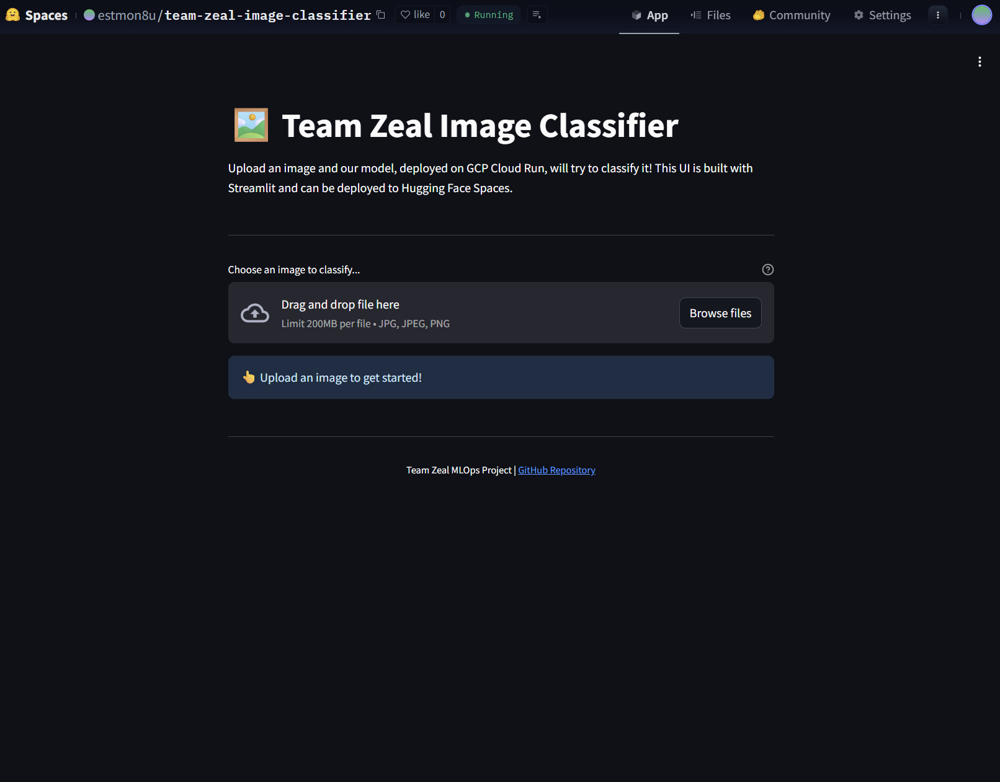

# Image Classification with Drift Detection & MLOps Pipeline

[](https://cookiecutter-data-science.drivendata.org/)

MLOps pipeline for image classification on Imagenette-160. This project utilizes Docker for containerization, DVC for data versioning with Google Drive (via Service Accounts), Hydra for configuration, Weights & Biases for experiment tracking, PyTorch Profiler for performance analysis, Continuous Machine Learning (CML) for automated reporting, and GitHub Actions for CI/CD. The CI/CD pipeline includes pushing Docker images to GCP Artifact Registry and trained models to GCP Cloud Storage. A FastAPI backend API is deployed on GCP Cloud Run, and an interactive Streamlit UI is deployed on Hugging Face Spaces to consume this API.

## Project Organization

```plaintext
├── .dockerignore        <- Specifies files to exclude from Docker image
├── .dvc/                <- DVC metadata and configuration
├── .github/             <- GitHub Actions workflows and composite actions
│   ├── actions/gcp-setup/action.yml <- Composite action for GCP authentication
│   └── workflows/docker-train-lint.yml <- Main CI/CD and CML workflow
├── .gitignore           <- Specifies intentionally untracked files for Git
├── .pre-commit-config.yaml <- Configuration for pre-commit hooks
├── .secrets/            <- (Gitignored) Directory for sensitive keys (e.g., GCP service accounts)
├── LICENSE              <- Open-source license
├── Makefile             <- Convenience commands for building, training, testing, etc.
├── PHASE1.md            <- Documentation for Phase 1 deliverables
├── PHASE2.md            <- Documentation for Phase 2 deliverables
├── PHASE3.md            <- Documentation for Phase 3 deliverables
├── README.md            <- This file: project overview and instructions
├── Dockerfile           <- Instructions to build the project's main training Docker image
├── api/                 <- FastAPI application for model serving
│   ├── Dockerfile       <- Dockerfile specific to the API
│   ├── entrypoint.sh    <- Entrypoint script for the API Docker container
│   ├── main.py          <- API endpoint logic
│   ├── requirements.txt <- API specific dependencies
│   └── .env             <- Example environment variables for API (e.g., model GCS path)
├── best_model.pth       <- (Gitignored, example) Placeholder for best model from a run
├── cml_plots/           <- (Gitignored) Plots generated for CML reports
├── cml_metrics.json     <- (Gitignored) Metrics exported for CML reports
├── conf/                <- Hydra configuration files (e.g., config.yaml)
├── data/                <- (DVC-managed, gitignored) Project data (raw, processed)
├── docker-entrypoint.sh <- Script executed when the main training Docker container starts
├── drift_detector_pipeline/ <- Python source code for the project
├── models/              <- (DVC-managed for baseline, or gitignored for CI outputs) Trained models
├── notebooks/           <- Jupyter notebooks for exploration (if any)
├── outputs/             <- (Gitignored) Hydra outputs, logs, saved models from local runs
├── pyproject.toml       <- Python project metadata and dependencies (PEP 517/518)
├── requirements.txt     <- Pinned Python dependencies for the main project
├── ui_streamlit/        <- Streamlit UI application
│   ├── streamlit_app.py <- Streamlit application code
│   ├── requirements.txt <- UI specific dependencies
│   └── README.md        <- README for the UI component
└── tests/               <- Unit and integration tests
```

---

## 1. Team Information

* **Team Name:** Team Zeal
* **Team Members:**
  * Montelongo, Esteban - <EMONTEL1@depaul.edu>
  * Bandara, Sajith - <SBANDARA@depaul.edu>
  * Sankar Chandrasekar, Arjun Kumar - <ASANKARC@depaul.edu>
* **Course & Section:** SE 489: ML Engineering For Production (MLOps)

## 2. Project Overview

* **Summary:** This project implements an end-to-end MLOps pipeline to train an image classification model (ResNet-18 using `timm`) on the Imagenette-160 dataset. It incorporates containerization with Docker, data versioning with DVC and Google Drive, experiment tracking with Weights & Biases, configuration management with Hydra, performance profiling with PyTorch Profiler, Continuous Machine Learning (CML) for automated reporting, and CI/CD with GitHub Actions. Docker images are managed in GCP Artifact Registry, and trained model artifacts are stored in GCP Cloud Storage. A FastAPI backend API is deployed on GCP Cloud Run, and an interactive Streamlit UI, deployed on Hugging Face Spaces, consumes this API for user-facing predictions.
* **Problem Statement:** Machine learning models in production often suffer performance degradation due to data drift. This project aims to build robust, reproducible, and analyzable training pipelines as a foundation for systems that can automatically detect such drift and maintain model performance.
* **Key Objectives:**
  * **Phase 1:** Establish a reproducible baseline training pipeline, DVC, Hydra, WandB integration, and unit tests. *(Status: Completed)*
  * **Phase 2:** Enhance with Docker containerization, advanced logging, code profiling, and CI/CD foundations. *(Status: Completed)*
  * **Phase 3:** Implement full CI/CD automation including Docker image management in GCP Artifact Registry, model artifact storage in GCS, CML reporting, API development and deployment to GCP Cloud Run, and an interactive Streamlit UI deployed to Hugging Face Spaces. *(Status: Completed)*

## 3. Project Architecture Diagram (Phase 3)

[Link to Live Mermaid Chart (Edit)](https://www.mermaidchart.com/app/projects/a791a045-ff95-417a-af0e-3ff4ad7cd646/diagrams/4300196f-397e-4681-886a-88e4fa6ba0e6/version/v0.1/edit)
*(This diagram illustrates the MLOps pipeline: Developers push code to GitHub, triggering GitHub Actions. The CI/CD pipeline lints, builds a Docker image (pushed to GCP Artifact Registry), and then uses this image to run training. After training, CML generates a report, and the best model is uploaded to GCS. The FastAPI application, deployed to GCP Cloud Run, serves predictions using models from GCS, and the Streamlit UI on Hugging Face Spaces calls this API.)*

## 4. Phase Deliverables

* [X] [PHASE1.md](./PHASE1.md): Project Design & Model Development
* [X] [PHASE2.md](./PHASE2.md): Enhancing ML Operations with Containerization & Monitoring
* [X] [PHASE3.md](./PHASE3.md): Continuous Machine Learning (CML) & Deployment *(All core objectives completed)*

## 5. Setup Instructions

This section guides you through setting up the project environment.

1. **Clone Repository:**

    ```bash
    git clone https://github.com/estmon8u/team-zeal-project.git # Or your SSH URL
    cd team-zeal-project
    ```

2. **Prerequisites:**
    * **Python:** Version 3.10 or higher.
    * **Make:** GNU Make.
    * **Docker Desktop:** Required for building and running Docker containers.
    * **Git:** For version control.
    * **Google Cloud SDK (`gcloud`):** For interaction with GCP. Install from [Google Cloud SDK documentation](https://cloud.google.com/sdk/docs/install).

3. **Create & Activate Virtual Environment (Recommended for Host Development):**

    ```bash
    make create_environment
    ```

    Activate:
    * Linux/macOS: `source .venv/bin/activate`
    * Windows PowerShell: `.\.venv\Scripts\Activate.ps1`

4. **Install Python Dependencies (Main Project):**
    (Ensure virtual environment is activated)

    ```bash
    make requirements
    ```

5. **Set up Weights & Biases (WandB):**
    * Create a [wandb.ai](https://wandb.ai) account.
    * **Local Development:** Create `.env` in project root with `WANDB_API_KEY="YOUR_KEY"`.
    * **CI/CD (GitHub Actions):** Add `WANDB_API_KEY` as a repository secret.
    * Configure project/entity in `conf/config.yaml`.

6. **Set up GCP Service Account(s) & Authentication:**
    * **6.1. For DVC Google Drive Access (Service Account):**
        1. Create a GCP Service Account, download its JSON key.
        2. Store locally as `.secrets/gdrive-dvc-service-account.json`.
        3. Share your DVC remote Google Drive folder with this SA's email (Editor role).
        4. `.dvc/config` specifies `gdrive_use_service_account = true`.
        5. `.dvc/config.local` (gitignored) points to the local key file.
        6. For CI/CD: Store key content in GitHub secret `GDRIVE_SA_KEY_JSON_CONTENT`.
    * **6.2. For GCP Artifact Registry & GCS Access (Service Account):**
        1. Create/use a GCP Service Account with "Artifact Registry Writer" and "Storage Object Admin" roles.
        2. For CI/CD: Store its JSON key content in GitHub secret `GCP_SA_KEY`.
        3. Store GCP Project ID in GitHub secret `GCP_PROJECT_ID`.
        4. Local GCP Access:

            ```bash
            gcloud auth login
            gcloud auth application-default login
            gcloud config set project YOUR_GCP_PROJECT_ID
            gcloud auth configure-docker YOUR_REGION-docker.pkg.dev
            ```

7. **DVC Cache (Host Setup):**
    Run `make ensure_host_dvc_cache`.

## 6. Usage Instructions

Use `make` commands from the project root. Pass Hydra/script arguments via `ARGS`.

### 6.1. Working Locally on Your Host Machine

(Activate virtual environment, ensure DVC/GCP auth)

* **Pull DVC Data:** `make dvc_pull`
* **Process Data:** `make process_data`
* **Train Model:** `make train ARGS="training.epochs=10"`
* **Tests, Linting, etc.:** `make test`, `make lint`, `make format`, `make clean`
* **Run API Locally:**

    ```bash
    # Ensure MODEL_GCS_PATH in api/.env is set or export it
    # export MODEL_GCS_PATH="gs://team-zeal-models/your-branch/your-sha_model.pth"
    make api_run
    ```

* **Run Streamlit UI Locally:**

    ```bash
    cd ui_streamlit
    pip install -r requirements.txt # If not already installed in main venv
    # Set PREDICTION_API_URL to your deployed Cloud Run API
    # e.g., export PREDICTION_API_URL="http://localhost:8008/predict/" # If API running locally
    # export PREDICTION_API_URL="https://YOUR_CLOUD_RUN_URL/predict/" # If API is deployed
    streamlit run streamlit_app.py
    cd ..
    ```

### 6.2. Working with Docker (Training & Main Project)

* **Build Training Docker Image:** `make docker_build`

* **Interactive Shell (Training Container):** `make docker_shell`
* **Pull DVC Data (Inside Training Container):** `make docker_dvc_pull`
* **Train Model (Inside Training Container):** `make docker_train ARGS="training.epochs=1"`
* **Run Tests (Inside Training Container):** `make docker_test`

### 6.3. Building & Pushing API Docker Image

* **Build API Image:** `make api_docker_build_gcp API_IMAGE_TAG=your_tag`

* **Push API Image to GCP AR:** `make api_docker_push_gcp API_IMAGE_TAG=your_tag`
    *(Ensure `GCP_PROJECT_ID_LOCAL` and `GCP_REGION_LOCAL` are set or detectable by `gcloud config`)*

## 7. Performance Profiling with PyTorch Profiler

Integrated into `drift_detector_pipeline/modeling/train.py`.

* **Configure:** `conf/config.yaml` under `training.profiler`.
* **Run:** `make train ARGS="training.profiler.enabled=true ..."`
* **View:** Traces in `outputs/YOUR_RUN_ID/pytorch_profiler_logs/` with TensorBoard or Perfetto.

## 8. Continuous Integration, Delivery & Machine Learning (CI/CD/CML)

GitHub Actions workflow (`.github/workflows/docker-train-lint.yml`) automates:

1. **Code Quality Checks:** Ruff linting and formatting.
2. **Docker Image Build & Push (Training):** Builds main project image, pushes to GCP Artifact Registry.
3. **Automated Training & Testing:** Uses the Docker image, pulls DVC data, trains, tests, logs to WandB.
4. **Model Upload to GCS:** Best model from CI training run is uploaded to GCS.
5. **CML Report Generation:** Posts metrics and plots to PRs/commits.
    * *Example CML reports can be found in the comments of Pull Requests or commits on the `main`/`develop` branches.*

### 8.1 Workflow Secrets

Configure in GitHub repository settings: `GCP_SA_KEY`, `GCP_PROJECT_ID`, `GDRIVE_SA_KEY_JSON_CONTENT`, `WANDB_API_KEY`.

### 8.2 Pre-commit Hooks

Setup with `pip install pre-commit && pre-commit install`. Configured in `.pre-commit-config.yaml`.

## 9. Model & Image Management in GCP

* **Docker Images:** Stored in GCP Artifact Registry (e.g., `YOUR_REGION-docker.pkg.dev/YOUR_PROJECT_ID/team-zeal-project/...`).
* **Trained Models (.pth):** Stored in GCS (e.g., `gs://team-zeal-models/BRANCH/COMMIT_SHA_model.pth`).

## 10. API (FastAPI) Deployment to GCP Cloud Run

The FastAPI application (`api/`) is deployed to GCP Cloud Run.

* **Image Source:** GCP Artifact Registry (built by `make api_docker_build_gcp`).
* **Deployment:** See section 10.1 below for `gcloud run deploy` commands or use `make api_deploy_cloudrun`.
* **Live API Endpoint (Example):** `https://team-zeal-api-run-1004281831193.us-west2.run.app/predict/` *(This is an example; replace with your actual deployed URL if different)*
* **Local API Run:** `make api_run` (ensure `MODEL_GCS_PATH` is set in `api/.env` or as an environment variable).

### 10.1 Deploying API to GCP Cloud Run (Manual Steps)

1. **Build and Push API Docker Image:**

    ```bash
    make api_docker_push_gcp API_IMAGE_TAG=your_api_tag # e.g., API_IMAGE_TAG=v1.0.0
    ```

2. **Deploy to Cloud Run:**
    (Ensure `gcloud` is configured with your project and region.)

    ```bash
    # Set shell variables (or use Makefile target 'make api_deploy_cloudrun')
    export SERVICE_NAME="team-zeal-api-run"
    export GCP_REGION="us-west2" # Your GCP region
    export GCP_PROJECT_ID="YOUR_GCP_PROJECT_ID" # Your GCP Project ID
    export API_ARTIFACT_REGISTRY_REPO="team-zeal-project"
    export API_IMAGE_NAME="team-zeal-project-api"
    export API_IMAGE_TAG="your_api_tag" # Tag used above

    export IMAGE_URI="${GCP_REGION}-docker.pkg.dev/${GCP_PROJECT_ID}/${API_ARTIFACT_REGISTRY_REPO}/${API_IMAGE_NAME}:${API_IMAGE_TAG}"
    # Example model path, update to your specific model in GCS
    export MODEL_GCS_PATH_FOR_SERVICE="gs://team-zeal-models/main/3f941fb_model.pth"

    gcloud run deploy ${SERVICE_NAME} \
      --image=${IMAGE_URI} \
      --platform=managed \
      --region=${GCP_REGION} \
      --allow-unauthenticated \
      --set-env-vars=MODEL_GCS_PATH=${MODEL_GCS_PATH_FOR_SERVICE} \
      --port=8080 \
      --memory=2Gi --cpu=1 --timeout=300s
    ```

3. **Test:**

    ```bash
    curl -X POST -F "file=@/path/to/your/image.jpg" YOUR_DEPLOYED_CLOUD_RUN_URL/predict/
    ```

## 11. Interactive Web UI (Streamlit on Hugging Face Spaces)

An interactive web interface for this image classifier is built using Streamlit and deployed on Hugging Face Spaces.

* **Streamlit Application Code:** `ui_streamlit/streamlit_app.py`.
* **Live Demo URL:** `https://huggingface.co/spaces/YOUR_HF_USERNAME/YOUR_HF_SPACE_NAME` *(Replace with your actual Space URL)*
* **Functionality:** Upload images, get classifications from the backend API, view results.

### 11.1 Running the UI Locally

```bash
cd ui_streamlit
pip install -r requirements.txt
# Set PREDICTION_API_URL to your deployed Cloud Run API URL
# e.g., export PREDICTION_API_URL="https://YOUR_CLOUD_RUN_URL/predict/"
streamlit run streamlit_app.py
cd ..
```

### 11.2 Deploying UI to Hugging Face Spaces

1. Create a new Streamlit Space on Hugging Face.
2. Upload `ui_streamlit/streamlit_app.py` (as `app.py`) and `ui_streamlit/requirements.txt` to the Space repository.
3. In the Space settings, add a secret:
    * **Name:** `PREDICTION_API_URL`
    * **Value:** Your full GCP Cloud Run API endpoint URL (e.g., `https://team-zeal-api-run-1004281831193.us-west2.run.app/predict/`)
The Space will build and deploy the app.

### 11.3 Example Screenshots





## 12. Contribution Summary

### PHASE 1 Contributions

* **Esteban Montelongo:** DVC setup & data versioning, `dataset.py` (extraction, transforms, dataloaders), initial documentation structure (`README.md`, `PHASE1.md`), architecture diagram, model DVC tracking, unit test implementation.
* **Sajith Bandara:** Hydra integration (`conf/config.yaml`, `train.py` decorator/config usage), `train.py` core structure (model loading, optimizer, scheduler, loop), Makefile setup (`train`, `process_data` rules), model saving path correction.
* **Arjun Kumar Sankar Chandrasekar:** WandB integration (`wandb.init`, `wandb.log`), dependency management (`pyproject.toml`, `requirements.txt`), `ruff` configuration and code formatting, testing infrastructure setup and test contributions.

### PHASE 2 Contributions

* **Esteban Montelongo:** Initial `Dockerfile` creation, `docker-entrypoint.sh` script for DVC authentication, `.dockerignore` setup, Docker build caching strategies, design and implementation of `docker-train-lint.yml` GitHub Actions workflow (initial CI for Docker builds & tests), significant refactoring of `Makefile` for Docker targets and OS-specific command handling.
* **Sajith Bandara:** Cross-platform compatibility enhancements for Docker-related `Makefile` targets (OS detection, volume pathing), integration of Docker shared memory (`--shm-size`), CI pipeline debugging and refinement, DVC service account authentication logic integration.
* **Arjun Kumar Sankar Chandrasekar:** Testing and validation of Docker image builds and container execution, ensuring dependency consistency, updating `README.md` with detailed setup and usage for Docker, DVC service account, Makefile targets, initial CI pipeline, and Profiling integration.

### PHASE 3 Contributions

* **Esteban Montelongo:** Enhanced GitHub Actions workflow (`docker-train-lint.yml`) to include pushing Docker images to GCP Artifact Registry, uploading trained models to GCS, and full CML report generation. Developed `gcp-setup` composite action. Implemented logic for branch-specific training parameters in CI. API Dockerfile (`api/Dockerfile`) and entrypoint (`api/entrypoint.sh`).
* **Sajith Bandara:** Refined CML reporting steps, including plot generation and metrics export within the training script. Debugged and optimized CI workflow steps, especially artifact handling and GCS interactions. Contributed to API (`api/main.py`) development for GCS model loading, local testing setup, and Cloud Run deployment scripting.
* **Arjun Kumar Sankar Chandrasekar:** Integrated pre-commit hooks (`.pre-commit-config.yaml`). Updated `Makefile` for API targets and refined Docker memory options. Updated project documentation (`README.md`, `PHASE*.md`) to reflect Phase 3 advancements. Developed Streamlit UI (`ui_streamlit/`) and deployed to Hugging Face Spaces.

## 13. References & Key Tools Used

* **Dataset:** [Imagenette-160 (v2)](https://github.com/fastai/imagenette)
* **ML Framework:** [PyTorch](https://pytorch.org/)
* **Model Zoo:** [timm (PyTorch Image Models)](https://github.com/huggingface/pytorch-image-models)
* **Containerization:** [Docker](https://www.docker.com/)
* **Data Versioning:** [DVC (Data Version Control)](https://dvc.org/) + Google Drive
* **Configuration Management:** [Hydra](https://hydra.cc/)
* **Experiment Tracking:** [Weights & Biases (WandB)](https://wandb.ai/)
* **Performance Profiling:** [PyTorch Profiler](https://pytorch.org/docs/stable/profiler.html)
* **Code Quality:** [Ruff](https://github.com/astral-sh/ruff), [Pytest](https://pytest.org/), [Pre-commit](https://pre-commit.com/)
* **Version Control:** [Git](https://git-scm.com/) & [GitHub](https://github.com/)
* **CI/CD & CML:** [GitHub Actions](https://github.com/features/actions), [CML (Continuous Machine Learning)](https://cml.dev/)
* **Cloud Platform:** [Google Cloud Platform (GCP)](https://cloud.google.com/)
  * [GCP Artifact Registry](https://cloud.google.com/artifact-registry)
  * [GCP Cloud Storage](https://cloud.google.com/storage)
  * [GCP Cloud Run](https://cloud.google.com/run)
* **API Framework:** [FastAPI](https://fastapi.tiangolo.com/)
* **UI Framework:** [Streamlit](https://streamlit.io/)
* **UI Deployment:** [Hugging Face Spaces](https://huggingface.co/spaces)
* **Build/Task Runner:** [GNU Make](https://www.gnu.org/software/make/)
* **Python Environment:** `venv` + `pip`
* **Project Template:** [Cookiecutter Data Science](https://cookiecutter-data-science.drivendata.org/)
